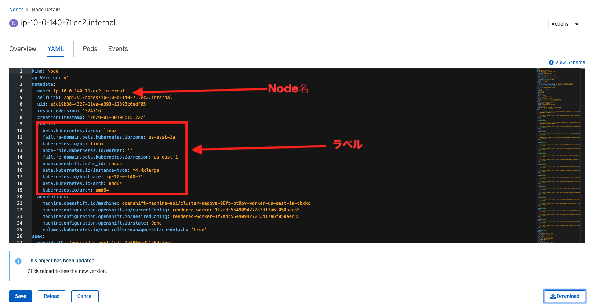

# 1. OpenShift4クラスターのリソース状況確認
各自のOpenShift4クラスターへ接続し，クラスター内コンポーネントの状況確認を次の手順で行います。  
- A) OpenShift4クラスターへのログイン ([1-1](#1-1-ログイン))
- B) プロジェクト(openshift-console)のリソース利用状況の確認 ([1−2-1](#1-2-1-プロジェクトのリソース利用状況の確認))
- C) クラスターを構成するNodeの確認 ([1-2-2](#1-2-2-クラスターを構成するnodeの確認))
- D) K8sワークロード の動作確認 (Lab1で実施)

## 1-1. ログイン
[ログイン方法](../Lab1/1_ocp4-tour.md#2-2.-OpenShift4へのログイン)

## 1-2. OpenShift4クラスターの状況確認
コンソールやocコマンドでクラスターの状態について確認しましょう。ただし基本的には**参照系のみ(oc get pod, oc describe deploy, oc logs xxx, etc.)を使用**します。

### 1-2-1. プロジェクトのリソース利用状況の確認
最初に，前の手順で作成した自身のプロジェクトを確認してみましょう。  
その後，他ユーザーとの共有プロジェクトである `openshift-consoleプロジェクト` のリソース利用状況を確認します。

**注意:**  
**プロジェクト確認については参照系のみです。変更は行わないようにしてください。複数人でクラスターを共用しているため，変更を加えてしまうと他の方の作業に影響が出てしまいます。**  

1. [Home]>[Projects]から [openshift-console] を選択します。

    

    openshift-consoleプロジェクトにおけるCPUやメモリなどのリソース利用状況が確認できました。  
    さらに下方では，Podによるメモリ利用量と，利用量の大きい順にTOP10が一覧表示されています。  

    
  
2. openshift-consoleプロジェクトの利用状況について詳細に見ていきます。

    グラフ内にカーソルを合わせて選択します。

    

    ログインを求められた場合は，OpenShift4クラスターへのログイン情報を使用します。  

    

    Authorized Accessのページが表示されたら，[Allow selected permissions]を選択します。
    >モニタリングツール(Prometheus)に対して，ReadOnlyで情報利用する許可を与えています。

    

    openshift-consoleプロジェクト(=openshift-consoleネームスペース)内のコンテナCPU利用量のグラフが描画されました。

    

    >折れ線グラフにカーソルを合わせると詳細情報が表示されます。
    >Prometheusに対して，以下のQueryを投げることで上図の情報を抽出しています。
    > - Query: 
    `namespace:container_cpu_usage:sum{namespace='openshift-console'}`
3. 任意のメトリクスを指定して描画してみます。

    [- insert metric at cursol -] を選択します。  

    

    例では，[apiserver_request_count] > Execute にように選択します。  

      

    以下図のように折れ線グラフが描画され，下部にはリクエストが一覧されています。カーソルをグラフなどに合わせて詳細情報を確認してみましょう。  

      

4. 自動で開かれたタブ(Prometheus-Grafanaの可視化)は，**モニタリングやロギングなど短期間で更新のある可視化画面であるため多量のリソースを消費**します。このため，必ずクローズしておきましょう。

OpenShift4では，各プロジェクト(ネームスペース)に属するあらゆるリソースのメトリクスを初期状態で取得できるようになっています。PrometheusやGrafanaなどを使うことでモニタリングおよび描画を実現しています。

### 1-2-2. クラスターを構成するNodeの確認
OpenShift4クラスターはIPIでデフォルト構成でインストールされた場合，Master3台/Worker3台以上のNode群で構成されます。  
Nodeの状態について確認してみましょう。

**注意:**  
**・Node確認については参照系のみ**  
**・変更は行わないこと**  
**・複数人でクラスターを共用しているため，変更を加えてしまうと他の方の作業に影響が出ます**  

1. [Compute] > [Nodes] を選択します。

    

    例えば `
ip-10-0-134-224.ap-northeast-1.compute.internal` のような名称で，計6台以上のNodeが一覧されています。また，MACHINE欄を見ると，`
group00-ocp4ws-basic-b9qqj-worker-ap-northeast-1a-t6rgd` や `group00-ocp4ws-basic-b9qqj-master-0` のようにMaster/Workerの文字列が確認できます。

2. 任意のWorkerを選択して詳細を確認します。

    [Overview]タブでは，選択した単一のNodeのCPUやメモリなどのリソース利用状況が確認できます。  
    プロジェクトと同様に，OpenShift4にデフォルト構成されているPrometheusが各メトリクスを抽出しています。
    
    

    

    [YAML]タブでは，OpenShift4上で管理されるNode情報をyaml形式で確認できます。Node名やアノテーション，ラベルなどの記載があります。
    
    
    
    [Pods]タブでは，指定したNode上で動作するPod一覧を確認できます。  
    例えば，`openshift-monitoringネームスペース`に属する grafanaのPodや，alertManagerなどが動作していることが分かります。
    
    
    
    [Events]タブでは，Nodeに起こったイベントについて時系列に表示されますNodeのステータスが変わったり，例えば割当リソースが変わったりなどの変化が起こると出力されます。
    
3. Nodeに対する操作(Action)を以下図のようにメニューを開いて確認します。
    
      

    ラベルの追加や削除などの変更をUI上で簡易的に行えます。  
    今回は編集しないので，**[Cancel]** を選択してクローズします。  

      

    アノテーションの追加や削除などの変更をUI上で簡易的に行えます。  
    今回は編集しないので，**[Cancel]** を選択してクローズします。  

      

    Node構成について，yamlを直接編集して変更が行えます。  
    今回は編集しないので，**[Cancel]** を選択してクローズします。  

      
    
    [Mark as Unschedulable] を選択することで，今後新しいPodが該当Nodeにスケジューリングされないように設定できます。  
    今回は編集しないので，**[Cancel]** を選択してクローズします。  

      

コンソール上で，OpenShift4クラスターを構成するNodeの数や種類，付与されたラベル，リソース利用状況，あるNode上で動作中のPod，Nodeの構成変更，などについて確認しました。

---
以上で，OpenShift4クラスターのリソース状況確認は完了です。
[Topへ](../README.md)  
