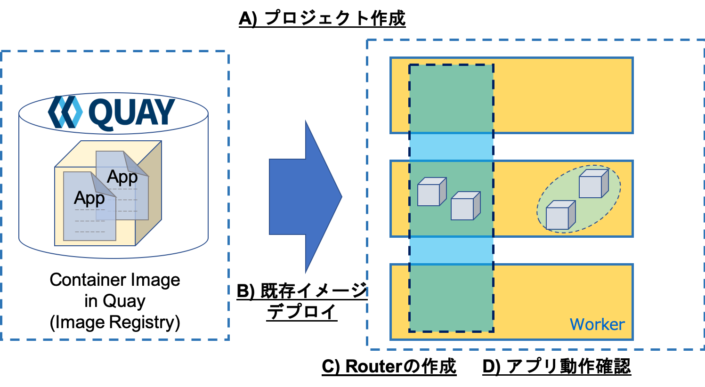
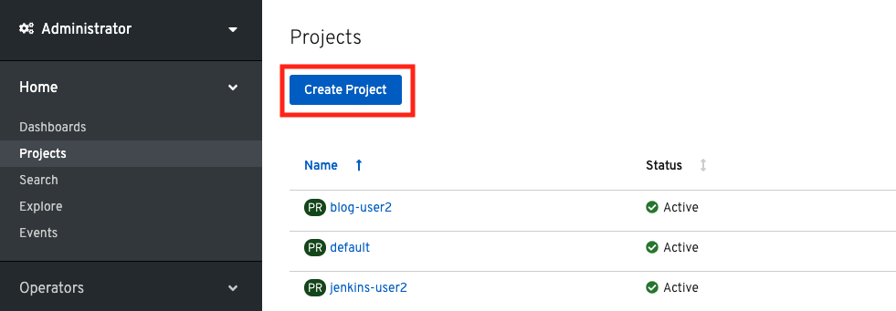
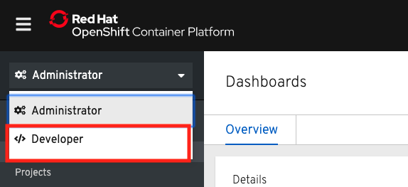
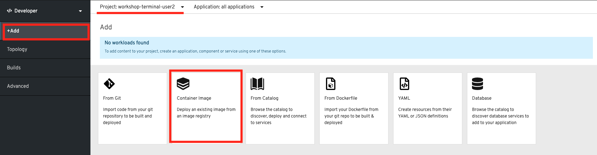
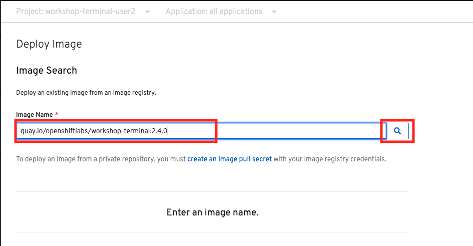
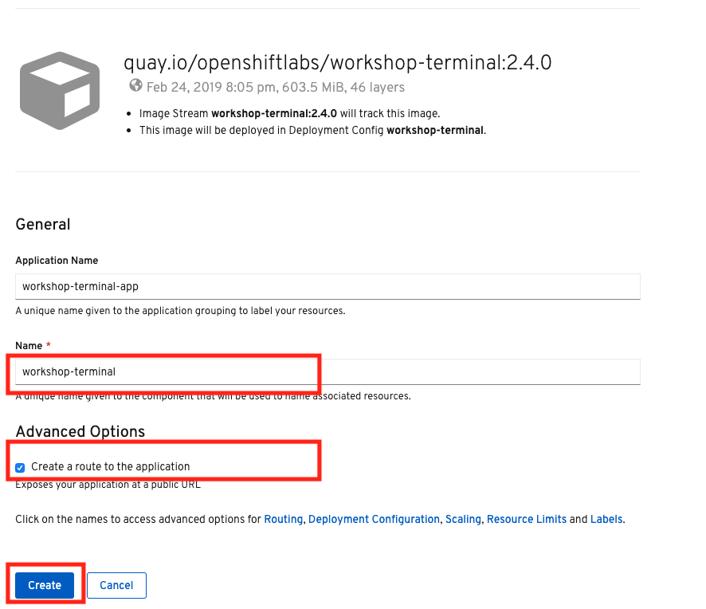
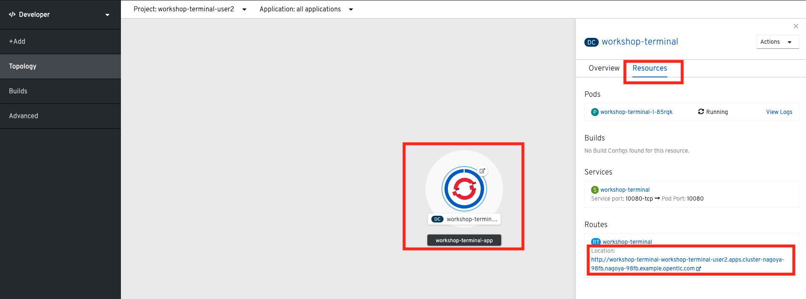
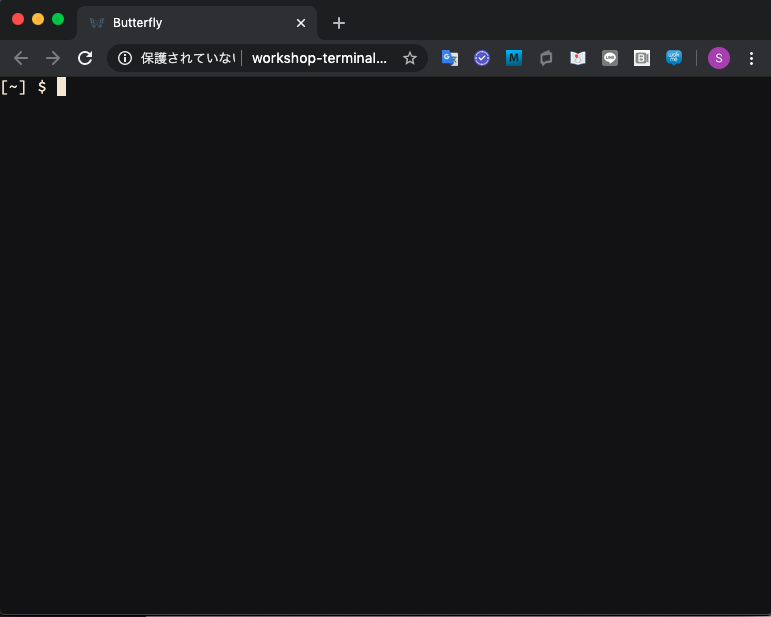

# 2. 既存のコンテナイメージのデプロイ
ビルド済(アプリケーションコードとビルダーイメージ(S2I BuilderImage)が結合済)の既存コンテナイメージをOpenShift4クラスターにデプロイします。

- A) プロジェクトの作成 ([2-2-1](#2-2-1-プロジェクト(namespace)の作成))
- B) 既存コンテナイメージのデプロイ ([2-2-2](#2-2-2-既存コンテナイメージのデプロイ))
- C) Routerの作成（イメージデプロイ時に作成）
- B) アプリケーションの動作確認 ([2-3-1](#2-3-1-アプリケーションの動作確認))

## 2-1. はじめに
### 2-1-1. 既存コンテナイメージについて
ここでいう "既存コンテナイメージ" は以下の2つが結合済のイメージのことを指しています。  
- アプリケーションコード
- Builder Image

### 2-1-2. 事前準備
- ターミナルへのアクセス情報
- OpenShift4クラスターへのアクセス情報

## 2-2. 既存コンテナイメージをOpenShift4にデプロイ
Lab1ではソースコードとbuidler imageを合体させてコンテナイメージを作成し，OpenShift4上にデプロイしました。  
Lab2の最初のステップでは，**既にコンテナイメージ化済** のターミナルアプリケーションをOpenShift4上にデプロイする手順を実施します。

### 2-2-1. プロジェクト(Namespace)の作成
OpenShift4コンソールで各自のプロジェクトを作成しましょう。  

1. [Home] > [Projects] > [Create Project] を選択します。  

    

2. プロジェクト名(例: `workshop-terminal-user00` )を指定し，**Create** を選択します。  
    
    プロジェクト名には，**必ずご自身のログイン時のユーザー名 (例: "workshop-terminal-user00")** を指定してください。  
    複数人でクラスターを共有しているため，他の人と重複しないプロジェクト名を指定する必要があります。  

    

### 2-2-2. 既存コンテナイメージのデプロイ
1. コンソールの左上からDeveloperコンソールに切り替えます。

2. [+Add] > [Container Image] のように選択します。

    

3. **Image Name** を指定して、**検索ボタン** をクリックします。
    - Image Name: `quay.io/openshiftlabs/workshop-terminal:2.4.0`

    

4. Name(workshop-terminal)と，**Create a route to the application** にチェックがあることを確認します。チェックがあることで、このタイミングで **Route** も作成されます。**Create**をクリックします。

    

## 2-3. 動作確認
### 2-3-1. アプリケーションの動作確認
1. [Topology] からアプリケーション（workshopーterminal）を選択し、 [Resources]タブを確認します。Routesにある**Location** を開きます。
    例) `http://workshop-terminal-workshop-terminal-user00.apps.group00-ocp4ws-basic.capsmalt.org`

    

2. Terminalアプリが表示されることを確認します。

    

## 2-4. [Trial works] - OpenShift4上にアプリをデプロイ2
お題: 

「**workshop-terminalアプリの特定バージョン(2.10.2)を新規にデプロイして，Routerの振り先を変更してみよう**」

ヒント:

- プロジェクト名(既存): `workshop-terminal-<yourID>` (例: `workshop-terminal-user00`)
- ContainerImage(新規): `quay.io/openshiftlabs/workshop-terminal:2.10.2`
- アプリ名(新規): `workshop-terminal-2102`
- Service名(アプリ名と同じ名前で自動生成): `workshop-terminal-2102`
  - (このServiceをRouterからの新しい振り先に指定すると良さそう...)
- Router名(既存): `workshop-terminal`
  - 既存のRouterの振り先を変更してみる
  - ([Networking] > [Routes] > [workshop-terminal] > [YAML] の `"spec.to.name"` あたりが怪しい...)

---
以上で，既存のコンテナイメージのデプロイは完了です。  
