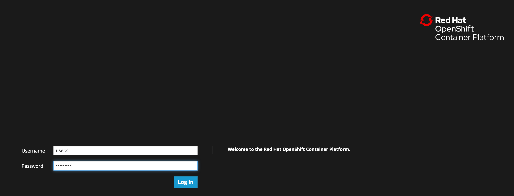

# 1. OpenShift4クラスターへのログインと動作確認
各自のOpenShift4クラスターに実際に接続し，クラスター内コンポーネントの動作確認を次の手順で行います。  
- A) OpenShift4クラスターへのログイン ([2-2](#2-2.-OpenShift4へのログイン))


## 2-1. はじめに
### 2-1-1. OpenShift4のインターフェース
- **ocコマンド** : kubectlをwrapしたOpenShift4を制御するCLIでログイン
  - `oc login <OpenShift_API>`: 任意のユーザーでログイン
  - `oc get pods -n default`: defaultネームスペースのPodを一覧表示
  - `kubectl get pods -n default` : kubectlも使用可
  - etc.
- **OpenShift4コンソール** : OpenShift4の専用コンソール画面にブラウザからログイン
  - PodやDeployment，Secretなどのワークロードや，ServiceやPVCなどの作成および編集
  - ワークロードやNodeの状態確認やモニタリング
  - カタログからのミドルウェア，アプリケーションのデプロイ
  - クラスター設定やネームスペース，ロール管理などのAdmin作業
  - etc.
### 2-1-2. 事前準備
- ターミナルへのアクセス情報
- OpenShift4クラスターへのアクセス情報

## 2-2. OpenShift4へのログイン
### 2-2-1. ocコマンドによるログイン(oc login)

1. ブラウザ(Chrome or Firefox)からターミナル機能へアクセスします。

    URLは、Etherpadの情報を参照してください。ログイン情報（Username:userX）を入力してログインします。
    > **※注意: ワークショップ参加者の方は，必ず自身に割当てられた <User_ID>，<User_PW> を使用してください。**  

    


    ブラウザ上にプロンプトが表示されればターミナルへのログイン成功です。

    

2. OpenShift4クラスターにocコマンドでログインします。

    ```
    [userX:~] $ oc login <OpenShift_API>

    Username: "<User_ID>" を入力
    Password: "<User_PW>" を入力
    ```

    >**※注意: ワークショップ参加者の方は，必ず自身に割当てられた <OpenShift_API>，<User_ID>，<User_PW> を使用してください。**  
    >
    >
    >例) 「OpenShift_API」へのログイン情報
    > - `<OpenShift_API>`: **https://api.group00-ocp4ws-basic.capsmalt.org:6443**
    > - `<User_ID>`: **user2**
    > - `<User_PW>`: **openshift**
    >
    >実行例) 
    >```
    >[user2:~] $ oc login https://api.cluster-nagoya-98fb.nagoya-98fb.example.opentlc.com:6443
    >The server uses a certificate signed by an unknown authority.
    >You can bypass the certificate check, but any data you send to the server could be intercepted by others.
    >Use insecure connections? (y/n): y
    >
    >Authentication required for https://>api.cluster-nagoya-98fb.nagoya-98fb.example.opentlc.com:6443 (openshift)
    >Username: user2
    >Password:
    >Login successful.
    >
    >You have access to 53 projects, the list has been suppressed. You can list all
    > projects with >'oc projects'
    >
    >Using project "default".
    >[user2:~] $
    >```

### 2-2-2. ブラウザからOpenShift4コンソールへのログイン
ブラウザ(別ウインドウやタブ)からOpenShift4のコンソールにログインします。

>**注意: ワークショップ参加者の方は，必ず自身に割当てられた <OpenShift_Console>，<User_ID>，<User_PW> を使用してください。**  
>例) 「OpenShift4コンソール」のログイン情報
> - `<OpenShift_Console>`: **https://console-openshift-console.apps.group00-ocp4ws-basic.capsmalt.org**
> - capsmalt's group を選択
> - `<User_ID>`: **user00**
> - `<User_PW>`: **openshift**

Privacy Errorが出た場合は，[Advanced] > [Proceed to oauth-openshift.apps.group00-ocp4ws-basic.capsmalt.org (unsafe)] のように選択して進めてください。


ログイン情報を入力してコンソールにログインします。


## 2-3. OpenShift4クラスターの動作確認

### 2-3-1. K8sワークロード の動作確認 (ocコマンド使用)
ocコマンドを使用して，K8sワークロードの動作状況を確認してみましょう。  

>クラスターにログインしてない場合は，`$ oc login <OpenShift_API>` でログインします。  
>

1. クラスターに含まれるプロジェクトを一覧します。

    ```
    $ oc get project

    NAME                                                    DISPLAY NAME   STATUS
    default                                                                Active
    kube-public                                                            Active
    kube-system                                                            Active
    openshift                                                              Active
    openshift-apiserver                                                    Active
    openshift-apiserver-operator                                           Active
    openshift-authentication                                               Active
    openshift-authentication-operator                                      Active
    openshift-cloud-credential-operator                                    Active
    openshift-cluster-machine-approver                                     Active
    openshift-cluster-node-tuning-operator                                 Active
    openshift-cluster-samples-operator                                     Active
    openshift-cluster-storage-operator                                     Active
    openshift-cluster-version                                              Active
    openshift-config                                                       Active
    openshift-config-managed                                               Active
    openshift-console                                                      Active
    openshift-console-operator                                             Active
    openshift-controller-manager                                           Active
    openshift-controller-manager-operator                                  Active
    openshift-dns                                                          Active
    openshift-dns-operator                                                 Active
    openshift-etcd                                                         Active
    openshift-image-registry                                               Active
    openshift-infra                                                        Active
    openshift-ingress                                                      Active
    openshift-ingress-operator                                             Active
    openshift-kube-apiserver                                               Active
    openshift-kube-apiserver-operator                                      Active
    openshift-kube-controller-manager                                      Active
    openshift-kube-controller-manager-operator                             Active
    openshift-kube-scheduler                                               Active
    openshift-kube-scheduler-operator                                      Active
    openshift-machine-api                                                  Active
    openshift-machine-config-operator                                      Active
    openshift-marketplace                                                  Active
    openshift-monitoring                                                   Active
    openshift-multus                                                       Active
    openshift-network-operator                                             Active
    openshift-node                                                         Active
    openshift-operator-lifecycle-manager                                   Active
    openshift-operators                                                    Active
    openshift-sdn                                                          Active
    openshift-service-ca                                                   Active
    openshift-service-ca-operator                                          Active
    openshift-service-catalog-apiserver-operator                           Active
    openshift-service-catalog-controller-manager-operator                  Active
    user00-lab1-2                                                          Active
    ```

2. openshift-console プロジェクト のワークロードを確認します。

    ```
    $ oc get po -n openshift-console
    NAME                         READY   STATUS    RESTARTS   AGE
    console-855bff5f9c-rhnmm     1/1     Running   0          16h
    console-855bff5f9c-xvttg     1/1     Running   1          16h
    downloads-5dc69d497c-7kvxb   1/1     Running   0          16h
    downloads-5dc69d497c-dxvz7   1/1     Running   0          16h
    
    $ oc get deploy -n openshift-console
    NAME        READY   UP-TO-DATE   AVAILABLE   AGE
    console     2/2     2            2           16h
    downloads   2/2     2            2           16h
    
    $ oc get svc -n openshift-console
    NAME        TYPE        CLUSTER-IP       EXTERNAL-IP   PORT(S)   AGE
    console     ClusterIP   172.30.159.179   <none>        443/TCP   16h
    downloads   ClusterIP   172.30.220.192   <none>        80/TCP    16h
    ```

ocコマンドは，Kubernetesを拡張したOpenShift4の制御をシンプルに行うために用意されているCLIですが，kubectlと同じ制御が行えます。例えば，`$ kubectl describe po`と同じ操作を `$ oc describe po` で行えます。余談ですが，もちろんkubectlコマンドをOpenShift4で使うこともできます。  

OpenShift4によって拡張された機能については，次のハンズオン([コンテナイメージのビルドとデプロイ](2_ocp4-build-deploy.md))で体験できます。  

---
以上で，OpenShift4クラスターへのログインと動作確認は完了です。  
次に [コンテナイメージのビルドとデプロイ](2_ocp4-build-deploy.md) のハンズオンに進みます。

