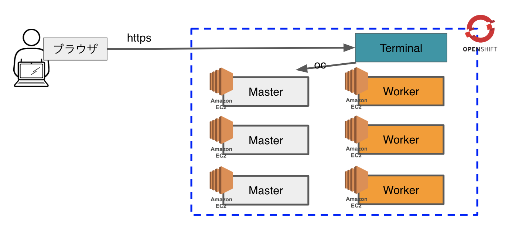

# ハンズオン概要
本ハンズオンは，OpenShift4の基礎編です。  
インフラ向け応用編(Operator他)および開発向け応用編(CodeReady他)のワークショップも不定期開催しています。

OpenShift4基礎編では以下を学びます。
- OpenShift4クラスターの構築 (本日は実施しません。クラスターは構築済です。)
- OpenShift4クラスターへのログインと動作確認
- コンテナイメージのビルドとデプロイ
- Jenkinsベースのビルドパイプラインの使用

### Lab1: [OpenShift4ログイン，コンテナイメージのビルド&デプロイ](Lab1)
### Lab2: [Jenkinsベースのビルドパイプラインの使用](Lab2)
### Ex-Lab: [動作確認、ビルド済みイメージのデプロイ](Extra)

# ハンズオン環境
本ハンズオンは，Kubernetesクラスター(OpenShift4)の動作環境としてAWSを使用します。今回は構築済です。  

OpenShift4クラスターに対するCLI操作をを行う際は，通常クライアントPCから，踏み台サーバーにSSH接続し，**ocコマンド** を使って制御しますが、今回は、ブラウザ上でターミナルを操作できる機能をOpenShift4上にデプロイしてあるので、時間短縮のためこちらを使用します。
`クライントPC（ブラウザ） <--HTTPS--> ターミナル機能 <--oc--> OpenShift4クラスター`

GUI操作は，クライアントPCのブラウザ(**Chrome/Firefox推奨**)を使用します。  

# 前提
- ブラウザ (Google Chrome or Firefox)
- ブラウザでの接続テスト
  - 下記リンクにブラウザからアクセスし，メモ帳アプリに正常アクセスできるか確認してください。
  - <<http://bit.ly/connectivity-test>>
  - **接続できない環境の場合はハンズオンを実施できない場合があります (サポートが必要な場合は担当者まで連絡ください)**

# 注意事項
OpenShift4クラスター接続情報などがEtherpad上に記載してあります。

